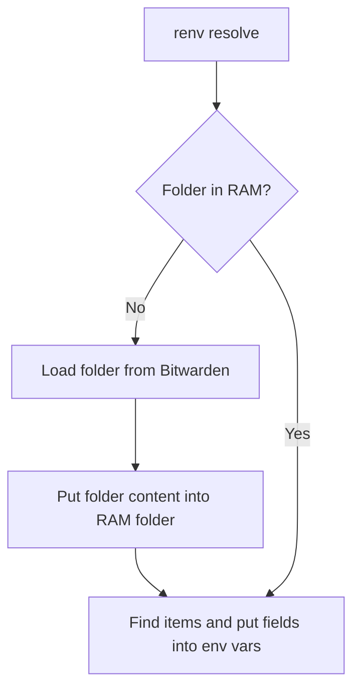

When loading data from bitwarden we want to ensure that we do not repeat duplicate work.

renv resolved explained as mermaid graph:

Files in ram are encrypted using the bitwarden or vault password used to retrive the items in the first place. If the variables needs to be re-introduced into the environment, the file is decrypted and the variables are loaded from it. This way we avoid hitting the bitwarden or vault API more than once per folder per session, while still keeping the secrets encrypted at rest on disk.

We need to ensure that there are a timeout for the RAM folder, so that secrets are not left decrypted on disk indefinitely. This can be achieved by implementing a cleanup mechanism that deletes the RAM folder after a certain period of inactivity or when the session ends.